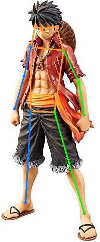
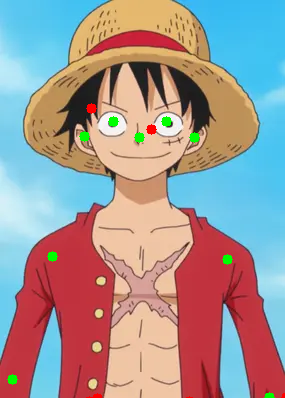
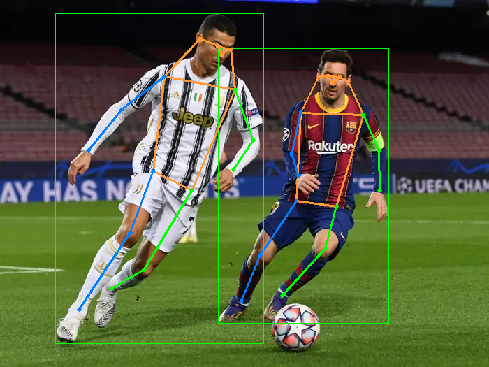

# onepose

Human **pose** estimation based on [ViTPose](https://github.com/ViTAE-Transformer/ViTPose) within **one line** 

```bash
pip install git+https://github.com/developer0hye/onepose.git
```

```python
import cv2
import onepose
img = cv2.imread("sample.png")
keypoints = onepose.create_model().to("cuda")(img)
```



One Piece's Luffy pose predicted by onepose

# Examples

## Plot keypoints on an image
```python
import cv2
import onepose

if __name__ == '__main__':
    img = cv2.imread('sample.png')
    model = onepose.create_model()

    keypoints = model(img)
    num_keypoints = len(keypoints['points'])
    
    for i in range(num_keypoints):
        print(f"Point {i} {model.keypoint_info[i]} (x, y) : {keypoints['points'][i]} confidence: {keypoints['confidence'][i]}")
        
        if keypoints['confidence'][i] < 0.5:
            color = (0, 0, 255)
        else:
            color = (0, 255, 0)
        
        cv2.circle(img, (int(keypoints['points'][i][0]), int(keypoints['points'][i][1])), 5, color, -1)
    cv2.imshow('img', img)
    cv2.waitKey(0)
```

Notice that occluded key points are plotted in red. You can discard these points using confidence score.



```python
Point 0 {'name': 'nose', 'id': 0, 'color': [51, 153, 255], 'type': 'upper', 'swap': ''} (x, y) : [139.64694 137.86743] confidence: [0.97471446]
Point 1 {'name': 'left_eye', 'id': 1, 'color': [51, 153, 255], 'type': 'upper', 'swap': 'right_eye'} (x, y) : [166.26282  121.430725] confidence: [0.90367746]       
Point 2 {'name': 'right_eye', 'id': 2, 'color': [51, 153, 255], 'type': 'upper', 'swap': 'left_eye'} (x, y) : [113.557556 121.25748 ] confidence: [0.93930066]       
Point 3 {'name': 'left_ear', 'id': 3, 'color': [51, 153, 255], 'type': 'upper', 'swap': 'right_ear'} (x, y) : [194.79327 137.52954] confidence: [0.8964122]
Point 4 {'name': 'right_ear', 'id': 4, 'color': [51, 153, 255], 'type': 'upper', 'swap': 'left_ear'} (x, y) : [ 84.58154 136.81473] confidence: [0.90676653]
Point 5 {'name': 'left_shoulder', 'id': 5, 'color': [0, 255, 0], 'type': 'upper', 'swap': 'right_shoulder'} (x, y) : [227.78476 259.47287] confidence: [0.8609412]   
Point 6 {'name': 'right_shoulder', 'id': 6, 'color': [255, 128, 0], 'type': 'upper', 'swap': 'left_shoulder'} (x, y) : [ 52.88922 256.38934] confidence: [0.83017635]
Point 7 {'name': 'left_elbow', 'id': 7, 'color': [0, 255, 0], 'type': 'upper', 'swap': 'right_elbow'} (x, y) : [269.67554 397.33008] confidence: [0.7196459]
Point 8 {'name': 'right_elbow', 'id': 8, 'color': [255, 128, 0], 'type': 'upper', 'swap': 'left_elbow'} (x, y) : [ 12.287186 379.43762 ] confidence: [0.65044713]    
Point 9 {'name': 'left_wrist', 'id': 9, 'color': [0, 255, 0], 'type': 'upper', 'swap': 'right_wrist'} (x, y) : [291.44168 401.09717] confidence: [0.0140133]
Point 10 {'name': 'right_wrist', 'id': 10, 'color': [255, 128, 0], 'type': 'upper', 'swap': 'left_wrist'} (x, y) : [ -9.994644 397.6245  ] confidence: [0.01367151]  
Point 11 {'name': 'left_hip', 'id': 11, 'color': [0, 255, 0], 'type': 'lower', 'swap': 'right_hip'} (x, y) : [189.8435  401.15857] confidence: [0.04964036]
Point 12 {'name': 'right_hip', 'id': 12, 'color': [255, 128, 0], 'type': 'lower', 'swap': 'left_hip'} (x, y) : [ 89.0609  401.10492] confidence: [0.02243446]
Point 13 {'name': 'left_knee', 'id': 13, 'color': [0, 255, 0], 'type': 'lower', 'swap': 'right_knee'} (x, y) : [286.65494 397.4558 ] confidence: [0.04406731]
Point 14 {'name': 'right_knee', 'id': 14, 'color': [255, 128, 0], 'type': 'lower', 'swap': 'left_knee'} (x, y) : [ 97.916   398.36865] confidence: [0.02304012]
Point 15 {'name': 'left_ankle', 'id': 15, 'color': [0, 255, 0], 'type': 'lower', 'swap': 'right_ankle'} (x, y) : [151.2844  129.83142] confidence: [0.01141046]
Point 16 {'name': 'right_ankle', 'id': 16, 'color': [255, 128, 0], 'type': 'lower', 'swap': 'left_ankle'} (x, y) : [ 91.45804 108.1178 ] confidence: [0.0140612]
```

## Multiple-person pose estimation with YOLOv8
```bash
pip install ultralytics
```
```python
import cv2
from ultralytics import YOLO
import onepose

detection_model = YOLO("yolov8m.pt")
pose_estimiation_model = onepose.create_model()

img = cv2.imread("multiple_person_sample.png")
draw_img = img.copy()

results = detection_model(img)[0]
boxes = results.boxes.xyxy
clses = results.boxes.cls
probs = results.boxes.conf

for cls, box, prob in zip(clses, boxes, probs):
    if cls != 0:
        continue

    x1, y1, x2, y2 = box
    # crop image
    person_img = img[int(y1):int(y2), int(x1):int(x2)]
    cv2.rectangle(draw_img, (int(x1), int(y1)), (int(x2), int(y2)), (0, 255, 0), 3)
    
    keypoints = pose_estimiation_model(person_img)
    num_keypoints = len(keypoints['points'])
    
    for i in range(num_keypoints):
        print(f"Point {i} (x, y)  : {keypoints['points'][i]} confidence: {keypoints['confidence'][i]}")
        
        if keypoints['confidence'][i] < 0.5:
            color = (0, 0, 255)
        else:
            color = (0, 255, 0)
        
        cv2.circle(draw_img, (int(keypoints['points'][i][0] + x1), int(keypoints['points'][i][1] + y1)), 3, color, -1)

cv2.imshow("draw_img", draw_img)
cv2.waitKey(0)
```



## Print supported models
```python
import onepose
print(onepose.list_models()) # ['ViTPose_base_simple_coco', 'ViTPose_large_simple_coco', 'ViTPose_huge_simple_coco', ...]
```

# References

[open-mmlab/mmpose](https://github.com/open-mmlab/mmpose)

[ViTAE-Transformer/ViTPose](https://github.com/ViTAE-Transformer/ViTPose)

[jaehyunnn/ViTPose_pytorch](https://github.com/jaehyunnn/ViTPose_pytorch)

[JunkyByte/easy_ViTPose](https://github.com/JunkyByte/easy_ViTPose)
